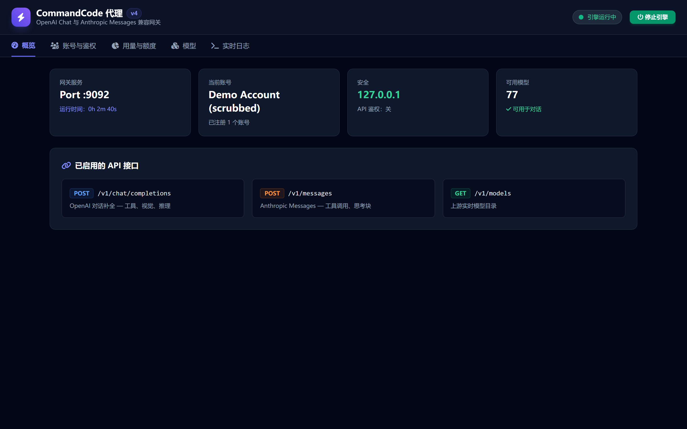
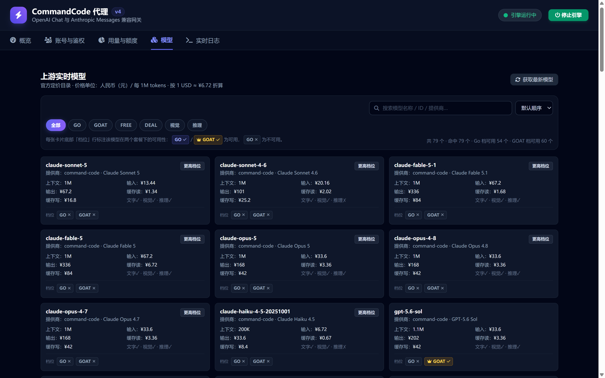
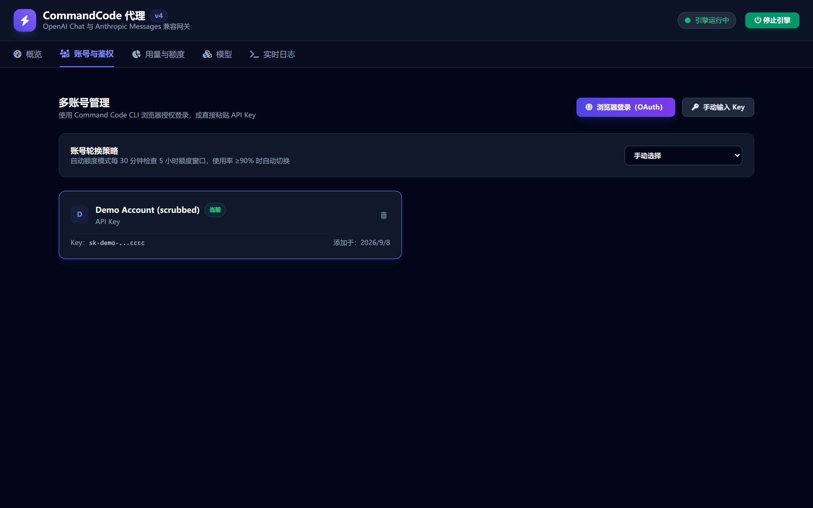

<div align="center">

# ⚡ CommandCode Proxy

[](https://github.com/wjf1/commandcode-proxy/blob/main/package.json)
[](https://github.com/wjf1/commandcode-proxy/actions/workflows/ci.yml)
[](https://github.com/wjf1/commandcode-proxy/actions/workflows/ci.yml)
[](./package.json)
[](./LICENSE)

**本地部署的 OpenAI / Anthropic 双协议网关，透明代理 CommandCode AI**

任何 OpenAI 风格客户端（Cursor、Continue、Aider、OpenWebUI、Hermes、你自己的代码）直接指向它，
即可透明使用 CommandCode 后端模型 —— 自带中文仪表盘、用量成本分析与多账号额度轮换。

[快速开始](#quickstart) · [用法](#usage) · [错误码](#errors) · [配置](#config) · [架构](#architecture) · [安全](#security)

**中文** | [English](#english-anchor)

</div>

> [!WARNING]
> 非官方社区工具。逆向自官方 CommandCode CLI wire 协议（`/alpha/generate`），与 CommandCode 无任何关联。上游协议变动时可能失效。

---

## 📑 目录

- [界面截图](#screenshots)
- [功能特性](#features)（协议兼容 / 可靠性与安全 / 仪表盘与用量洞察 / 工程与运维）
- [快速开始](#quickstart)
- [用法](#usage)
- [错误码与重试语义](#errors)
- [配置](#config)
- [开发](#development)
- [架构](#architecture)
- [安全校验](#security)
- [免责声明与许可证](#license)

---

## 🖼 界面截图
<a id="screenshots"></a>

除命令行外，代理自带一个**中文 Web 仪表盘**（默认 `http://127.0.0.1:9090`）。以下为实际界面截图（均已脱敏）：

| 控制台总览 | 模型目录 | 账号与鉴权 |
|:---:|:---:|:---:|
|  |  |  |

- **总览** — 一屏掌握运行状态：引擎启停、端口、运行时长、当前账号、绑定地址、鉴权开关、账号数与可用模型数；顶部一键切换引擎。
- **模型目录** — 官方定价目录（上下文 / 输入 / 输出 / 缓存读 / 缓存写 / 能力 / Deal）实时刷新；支持关键词搜索、GO / FREE / DEAL / 视觉 / 推理标签筛选与多列排序。
- **账号** — 浏览器 OAuth 登录或粘贴 Key；多账号管理与 5 小时额度轮换（≥90% 自动切换）；密钥一律**脱敏显示**。

---

## ✨ 功能特性
<a id="features"></a>

### 🔌 协议兼容

- **OpenAI `/v1/chat/completions`** — 流式 SSE + 非流式；工具调用（并行工具、流式 `tool_calls` 增量）；视觉（`image_url` base64 / data-URL）；`reasoning_effort` 按模型档位向下对齐；`max_completion_tokens`；透传上游 `totalUsage`
- **Anthropic `/v1/messages`** — 完整流式块生命周期（`message_start` → `content_block_start/delta/stop` → `signature_delta` → `message_delta` → `message_stop`）；`tool_use` / `tool_result` 往返；thinking 块（签名兼容）；system 块数组
- **忠实还原 wire 翻译** — 经官方 CLI 源码逐行核对：原始 base64 图片块带 `mediaType`、`tool_search→search_tools` 别名、终止性错误不重试清单（`model_not_in_plan`、`premium_credits_exhausted`、`insufficient credits`）
- **工具定义全量透传** — 不截断为 15 个：多工具 Agent 宿主（DSH Desktop 等）下发的 30+ 个工具全部转发，避免模型调用到被丢弃的工具而被上游拒绝
- **模糊模型名解析 + 套餐过滤** — 未知模型**原样透传**（上游给出准确报错，而不是静默换成默认模型）；`GET /v1/models` 支持按档位过滤（fail-open，数据缺失不误杀）

### 🛡 可靠性与安全

- **长连接加固** — 429/5xx/网络错误指数退避重试；空闲流看门狗（不会无限挂起）；客户端断开立即取消上游；流干净收尾（补 finish、SSE 心跳防代理断连）
- **安全默认** — 仅绑定 `127.0.0.1`；可选 `PROXY_API_KEY` 共享密钥（**同时覆盖 API 与管理面**，仪表盘首次访问弹密钥输入）；`/api/*` 写操作校验 Origin；XSS 加固；CORS 仅对公共 API 表面开放；绑定非回环且未鉴权时界面与启动日志双重警告
- **上游 SSRF 防护（fail-closed）** — 所有服务端上游请求经白名单校验：仅 `http(s)`、拒绝内嵌凭据、默认拒绝环回/私有/保留地址、非回环强制 `https`，详见[安全校验](#security)
- **结构化错误码** — 17 个稳定错误码 + 可执行提示，按出口分别返回 OpenAI `error.type/code` 与 Anthropic `error.type`，调用方可据此决定等额度、换模型还是改配置（见[错误码表](#errors)）
- **桌面通知（Windows toast）** — 额度将耗尽、账号被切走、引擎暂停时主动弹出；原生 `Windows.UI.Notifications` 零依赖，30 分钟去重限频；**自诊断**系统通知总开关（被静默拒绝的 toast 只能靠主动检测暴露），`COMMANDCODE_NOTIFY=0` 关闭

### 📊 仪表盘与用量洞察

- **会话明细** — 逐请求记录 input/output token、缓存命中量、耗时、成本、模型、状态；按天趋势折线、模型分布饼图、今日/本周/本月成本卡片；持久化 `~/.commandcode/usage-history.jsonl`（超 20MB 自动轮转），重启不丢
- **成本口径对齐官方账单** — 优先采用上游 `provider-metadata` 的权威金额（已含峰谷价、缓存折扣）；缺失时本地按**缓存读/写分项 + 峰谷分时**估算；估算值带 `~` 前缀可对照
- **缓存节省可视化** — 显示缓存命中相比全价输入**省下的金额**及相对账面成本的倍数，直接回答"为何账单远低于直觉"；按每条记录自身时刻的费率计算
- **峰谷计费提示** — 当前峰/谷档位、切换倒计时与受影响模型的生效费率；切换点按官方边界（UTC 01/04/06/10，周一至周五）计算，跨周末也正确
- **端到端性能 + 额度燃烧预测** — 每模型吞吐/延迟 P50/P95（口径明确标注端到端）；对官方窗口用量做时间差分，外推"多少分钟后撞限、是否早于重置"（刻意不用本地历史——只覆盖代理流量约 18%，会严重高估剩余时间）
- **会话与项目归因** — 会话 ID 取客户端声明的 `x-session-id`（**事实性标识**）；项目只能**推断**（system prompt 文本），逐条标注置信度（`label` 高置信 / `heuristic` 推测），未识别项单列而非猜测；日期分组按客户端时区
- **官方用量总览 + 计费周期** — Total Tokens / Total Runs / 成功率 / 月度限额对齐官方 usage 页数据源；套餐名、额度上限、`currentPeriodStart/End`、周期进度（订阅额度到期不结转，一眼可见还剩几天）

### 🧰 工程与运维

- **日志持久化** — 全量追加 `logs/proxy.log`（超 5MB 轮转 `.old`），控制台窗口关掉仍可事后排查；错误日志带 `Trace`/`Thread`，可对到用量记录
- **用量统计缓存** — 45s TTL + 并发去重，仪表盘重复拉取从 ~2.9s 降到毫秒级
- **崩溃保护** — 5 分钟内 3 次未捕获异常即主动退出，交给服务管理器重启
- **打包与 CI** — TypeScript + esbuild + `pkg` 单文件 exe；GitHub Actions 全量回归（typecheck → build → 216 项测试）
- **离线可用的仪表盘** — Tailwind / Font Awesome / Chart.js 全部本地化，不依赖公共 CDN
- **Anthropic SDK 兼容** — `POST /v1/messages/count_tokens` 本地估算（CJK 感知，不发起上游请求）；OpenAI `stream_options.include_usage` 在收尾 chunk 附带 usage
- **每日预算告警 + 更新检查** — `DAILY_BUDGET_USD` 当日花费超阈值弹 toast；启动时查询 GitHub Releases，仪表盘头部显示"新版本"徽章
- **明细导出** — 用量页一键导出 CSV（含 BOM，Excel 直开）

---

## 🚀 快速开始
<a id="quickstart"></a>

```bash
npm install
npm run dev          # http://127.0.0.1:9090
```

或生产模式：

```bash
npm run build && npm start
```

或独立二进制：

```bash
npm run build:win    # dist/commandcode-proxy-v4.exe —— 零依赖运行
```

> [!TIP]
> 首次启动仪表盘会自动打开。通过**浏览器登录（OAuth）**或粘贴 API Key 登录；密钥也会自动从 `~/.commandcode/auth.json` 或 `COMMANDCODE_API_KEY` 加载。

## 🧪 用法
<a id="usage"></a>

```bash
# OpenAI 风格（示例用免费模型，任何套餐可直接跑通）
curl http://127.0.0.1:9090/v1/chat/completions \
  -H "Content-Type: application/json" \
  -d '{"model":"meituan/LongCat-2.0:free","messages":[{"role":"user","content":"hi"}]}'

# Anthropic 风格
curl http://127.0.0.1:9090/v1/messages \
  -H "Content-Type: application/json" \
  -d '{"model":"meituan/LongCat-2.0:free","max_tokens":1024,"messages":[{"role":"user","content":"hi"}]}'
```

> 模型名以仪表盘"模型"页或 `GET /v1/models` 实时目录为准；免费/折扣模型标有 FREE / DEAL 标签。

> [!IMPORTANT]
> **不支持的字段**（接受但被忽略，不报错）：`stop` / `stop_sequences`、`response_format`、`top_k`、`parallel_tool_calls`、`logprobs`、`n`、`seed` 及频率/存在惩罚。依赖这些字段控制输出形态的客户端请注意；需要 stop 语义请在上游模型侧或客户端侧过滤。

客户端配置：OpenAI 风格 base URL 设为 `http://127.0.0.1:9090/v1`，Anthropic 风格设为 `http://127.0.0.1:9090`，密钥随意（若设置了 `PROXY_API_KEY` 则须一致）。

按套餐筛选可用模型（`plan` 可显式指定，省略则用当前账号套餐；不带 `available` 为完整目录）：

```bash
curl "http://127.0.0.1:9090/v1/models?plan=individual-go&available=1"
```

## 🚨 错误码与重试语义
<a id="errors"></a>

任何失败都返回**稳定错误码 + 可执行提示**，调用方可据此判断该等待额度、换模型还是改配置。

OpenAI 出口（`/v1/chat/completions`）：

```json
{ "error": { "message": "Upstream error 429: insufficient credits", "type": "rate_limit_error",
             "code": "RATE_LIMIT", "param": null, "hint": "The plan usage window (5-hour or weekly) is exhausted..." } }
```

Anthropic 出口（`/v1/messages`）：

```json
{ "type": "error", "error": { "type": "rate_limit_error", "message": "...",
                              "code": "RATE_LIMIT", "hint": "..." } }
```

| `code` | HTTP | 含义 |
|---|:---:|---|
| `MISSING_CREDENTIAL` | 401 | 没有任何可用 Key（环境变量/auth.json/账号池皆空） |
| `INVALID_CREDENTIAL` | 401 | Key 失效或被吊销 |
| `PROXY_AUTH_REQUIRED` | 401 | 未携带匹配的 `PROXY_API_KEY` |
| `RATE_LIMIT` | 429 | 5 小时/周额度耗尽，或余额不足 |
| `MODEL_NOT_IN_PLAN` | 403 | 模型超出当前套餐档位 |
| `MODEL_NOT_FOUND` | 404 | 模型 id 不存在（刷新目录后重试） |
| `UNSUPPORTED_OPTION` / `UNSUPPORTED_CONTENT` | 400 | 请求形态或内容无法翻译到上游 wire |
| `REQUEST_TIMEOUT` / `STREAM_IDLE_TIMEOUT` | 504 | 请求超时 / 流中途静默被看门狗中止 |
| `NETWORK_ERROR` | 502 | 连不上上游 API |
| `SERVER_ERROR` | 5xx | 上游 5xx（**保留上游真实状态码**） |
| `PROVIDER_PROTOCOL_ERROR` | 502 | 上游返回体异常（缺 body 等） |
| `CATALOG_UNAVAILABLE` | 503 | 模型目录不可用 |
| `GATEWAY_PAUSED` | 503 | 引擎已在面板暂停 |
| `GATEWAY_BUSY` | 503 | 达到 `MAX_UPSTREAM_CONCURRENCY` 上限（默认不限制） |
| `BLOCKED_HOST` | 500 | 上游地址被 SSRF 防护拒绝 |
| `INTERNAL_ERROR` | 500 | 网关内部异常 |

**重试语义**：`408/409/425/429/500/502/503/504` 按指数退避重试（上限 `upstream.maxRetries`）；一旦命中终止性计费/套餐标记（`model_not_in_plan`、`premium_credits_exhausted`、`insufficient credits`）**立即失败、绝不重试**——重试只会白耗额度。重试耗尽后仍保留上游真实状态码与错误码，不会包装成"网络故障"。

> [!NOTE]
> 流式请求在 HTTP 200 已发出后无法再改状态码，此时错误码会并入内容文本，形如 `[Upstream Error: RATE_LIMIT: ...]`，便于客户端自愈。

## ⚙️ 配置
<a id="config"></a>

| 环境变量 | 默认值 | 作用 |
|---|---|---|
| `PORT` | `9090` | 监听端口 |
| `HOST` | `127.0.0.1` | 绑定地址（`0.0.0.0` 暴露到局域网） |
| `PROXY_API_KEY` | 未设置 | 要求 `/v1/*` **与管理面 `/api/*`** 携带该密钥（Bearer 或 `x-api-key`）；仪表盘首次访问会弹出密钥输入，本标签页内记住 |
| `COMMANDCODE_API_KEY` | 取自 auth.json | 上游密钥兜底；无命名账号时账号名显示为 `CLI Key (尾4位 xxxx)` / `Env Key (尾4位 xxxx)`，启动后由 whoami 异步补全真实用户名 |
| `COMMANDCODE_API_BASE` | `https://api.commandcode.ai` | 上游服务地址 |
| `COMMANDCODE_UPSTREAM_ALLOWED_HOSTS` | 未设置 | 追加允许的上游 host（逗号分隔，供自建网关/镜像）；环回/私有/保留地址默认拒绝，仅在此显式加入才放行 |
| `COMMANDCODE_VERSION` | `1.27.1` | CLI 版本标识头 |
| `ROTATION_MODE` | `manual` | `auto-quota` 启用 30 分钟额度检查 |
| `NO_OPEN_BROWSER` | 未设置 | 设为 `1` 跳过仪表盘自动打开 |
| `MAX_BODY_MB` | `64` | 入站 JSON 请求体上限（MB）；视觉/多图 base64 负载超默认 1MB 会触发 413，范围 1..1024 |
| `USAGE_HISTORY_MAX_MB` | `20` | 会话历史大小上限（MB）；超限保留较新的一半，防止无限增长拖慢聚合 |
| `COMMANDCODE_LOG_PATH` | `<项目根>/logs/proxy.log` | 运行日志落盘路径（超 5MB 轮转 `.old`） |
| `DAILY_BUDGET_USD` | 未设置（关） | 每日预算告警：当日累计成本（服务器本地日）达到阈值时弹一次 toast；进程重启会从历史回填当日已计费金额 |
| `MAX_UPSTREAM_CONCURRENCY` | 不限制 | 上游并发上限；超限请求以 `GATEWAY_BUSY`(503) 快速失败，防失控客户端压起大量长流 |
| `COMMANDCODE_NOTIFY` | 开 | 设 `0/false/off` 关闭桌面通知 |

持久化配置存于可执行文件旁的 `config.json`。同目录的 `.env`（由仪表盘添加账号时自动维护）也会在启动时加载——**已存在的环境变量优先**，docker/systemd 注入不受影响。

## 🛠️ 开发
<a id="development"></a>

```bash
npm run typecheck    # tsc --noEmit
npm test             # vitest —— 单元 + 集成（mock 上游，端到端真实 HTTP 面）
npm run build:exe    # esbuild 打包
npm run build:win    # Windows exe
```

集成测试会拉起一个 mock CommandCode 上游，端到端验证流式 chunk 形状、工具调用往返、推理档位 snap 与 Anthropic 块生命周期。agent 驱动的自测方案见 [HERMES_TEST_PROMPT.md](./HERMES_TEST_PROMPT.md)。

## 🏗 架构
<a id="architecture"></a>

```
src/
├── index.ts                      # 启动引导、额度轮换调度、可选鉴权钩子
├── types/index.ts                # OpenAI / Anthropic / CC-wire 契约
├── adapters/commandcode/
│   ├── adapter.ts                # 翻译引擎（两种协议 ↔ CC wire，含中文注释）
│   └── upstream.ts               # HTTP 客户端：重试、空闲看门狗、中止
├── routes/
│   ├── chat.ts                   # POST /v1/chat/completions
│   ├── messages.ts               # POST /v1/messages
│   ├── models.ts                 # GET /v1/models、refresh
│   ├── dashboard.ts              # 管理 API 与静态资源路由
│   └── sse-common.ts             # 双出口共享：SSE 头/事件解析/持久化
└── utils/
    ├── config.ts                 # 账号、OAuth 流程、额度轮换
    ├── models.ts                 # 目录同步 + 官方定价富化 + 模糊解析
    ├── usage-store.ts            # 会话明细持久化 + 聚合统计
    ├── plans.ts                  # 套餐档位表 + 模型可用性
    ├── quota-tracker.ts          # 额度采样与燃烧速率预测
    ├── request-context.ts        # 会话/项目归因提取
    ├── notifier.ts               # Windows toast + 自诊断
    ├── paths.ts                  # 路径解析（logger/config/models 共用）
    └── logger.ts                 # 净化环形缓冲日志 + 文件落盘
public/
├── index.html                    # 仪表盘 SPA（中文界面）
└── vendor/                       # 本地化的 tailwind / font-awesome / chart.js
```

## 🔒 安全校验 · Upstream URL safety
<a id="security"></a>

代理对**所有**服务端上游请求做白名单校验，采用 fail-closed（不满足即拒绝），而非降级放行。

校验顺序：仅允许 `http(s)` → 拒绝内嵌凭据 → 拒绝环回/私有/保留地址（除非显式允许）→ host 属于 `commandcode.ai` 及子域或显式允许清单 → 非回环强制 `https`，全满足才放行。

- **默认只允许** `commandcode.ai` 及其子域；环回（localhost、127.x、::1）、私有（10.x、172.16-31.x、192.168.x、100.64/10 CGNAT）、保留/链路本地（169.254.x、IPv6 ULA/链路本地、198.18/15）及任意公网地址默认一律拒绝，除非运维显式加入允许清单。
- **环回/私有受控例外**：本地 mock 上游、自建网关/镜像需通过 `COMMANDCODE_UPSTREAM_ALLOWED_HOSTS` **显式**加入才放行。这是**运维显式配置**的受控例外——上游地址只由 `COMMANDCODE_API_BASE` 等运维环境变量决定，不随客户端请求参数变化，因此不存在把客户端输入导向内网的 SSRF 路径。
- **配套校验**：拒绝非 `http(s)` 协议（防 `file:`、`gopher:` 协议混淆）、拒绝内嵌凭据（`user:pass@host`）、非回环 host 强制 `https`（防降级明文；回环且显式放行时允许 http，供本地 mock）。

## 📄 免责声明与许可证
<a id="license"></a>

本项目通过观察官方 CLI 的网络行为来与私有 API 互通。上游协议变动时可能失效，使用可能受 CommandCode 服务条款约束。请用自己的账号与凭据使用。

本项目使用 **MIT 许可证** 发布，详见 [LICENSE](./LICENSE)。

---

## <a id="english-anchor"></a>🇬🇧 English

<div align="center">

**A local, fully-compatible OpenAI / Anthropic API gateway for CommandCode AI**

Point any OpenAI-style client (Cursor, Continue, Aider, OpenWebUI, Hermes, your own code) at it and use CommandCode backend models transparently — with a built-in dashboard, usage & cost analytics and multi-account quota rotation.

</div>

> [!WARNING]
> Unofficial, community tool. Reverse-engineered from the official CommandCode CLI wire protocol (`/alpha/generate`). Not affiliated with CommandCode; may break when the upstream changes. Use with your own account and credentials. The bilingual sections above (screenshots, security) apply here too.

### Features

**Protocol compatibility**

- **OpenAI `/v1/chat/completions`** — streaming SSE + non-streaming; tool calling (parallel tools, streamed `tool_calls` deltas); vision (`image_url` base64/data-URL); `reasoning_effort` snapped down to per-model tiers; `max_completion_tokens`; usage passthrough from upstream `totalUsage`
- **Anthropic `/v1/messages`** — full streaming block lifecycle (`message_start` → `content_block_start/delta/stop` → `signature_delta` → `message_delta` → `message_stop`); `tool_use` / `tool_result` round-trip; thinking blocks with signature compatibility; system block arrays
- **Faithful wire translation**, verified line-by-line against the original CLI: raw-base64 image parts with `mediaType`, `tool_search→search_tools` aliasing, terminal-error no-retry list
- **Full tool passthrough** — no truncation to 15; the 30+ tools issued by multi-tool agent hosts are all forwarded
- **Fuzzy model resolution + per-plan filtering** — unknown models pass through as-is (upstream returns an accurate error instead of a silently substituted default); `GET /v1/models?plan=…&available=1` (fail-open)

**Reliability & security**

- Exponential-backoff retries on 429/5xx/network errors; idle-stream watchdog (no infinite hangs); client-disconnect cancellation; clean stream termination with SSE keepalive comments
- Secure defaults: loopback-only binding; optional `PROXY_API_KEY` covering **both `/v1/*` and the admin surface `/api/*`** (dashboard prompts on first visit); Origin check on `/api/*` mutations; XSS-hardened dashboard; CORS limited to the public API surface; prominent warnings when bound non-loopback without auth
- **SSRF guard, fail-closed** — see the bilingual [Upstream URL safety](#security) section
- **Structured error codes** — 17 stable codes with actionable hints, surfaced as OpenAI `error.type/code` or Anthropic `error.type` (table below)
- Windows toast notifications for quota exhaustion / account switch / engine pause — native, zero dependencies, 30-min dedupe, with **self-diagnosis** of the system-wide notification switch; disable via `COMMANDCODE_NOTIFY=0`

**Dashboard & usage insight**

- Per-request session detail (tokens, cache hits, latency, cost, model, status) with daily trend, model doughnut and today/week/month cards; persisted to `~/.commandcode/usage-history.jsonl` (rotated at 20MB)
- **Cost reconciled with the official bill** — prefers the authoritative `provider-metadata` amount (peak/off-peak and cache discounts included); local fallback prices cache read/write separately by time-of-day; estimates carry a `~` prefix
- **Cache savings visualization** — how much cache hits saved versus full input price, and the multiple relative to billed cost
- **Peak/off-peak indicator** — current tier, countdown to switch, active rates; switch points follow official boundaries (UTC 01/04/06/10, Mon–Fri), weekends handled correctly
- **End-to-end perf + quota burn-rate projection** — per-model throughput/latency P50/P95 (explicitly end-to-end, not model generation speed); official window usage differenced over time to project minutes-to-cap vs reset
- **Session & project attribution** — session IDs are client-declared (factual); projects are inference-only, labelled per row (`label` high-confidence / `heuristic`), unattributed traffic listed separately; day grouping follows client timezone
- **Official usage overview + billing cycle** — Total Tokens / Runs / success rate / monthly limit aligned with the official usage page; plan name, caps, `currentPeriodStart/End`, cycle progress

**Engineering & ops**

- Log persistence to `logs/proxy.log` (5MB rotation); error logs carry `Trace`/`Thread` to correlate with usage records
- Usage-stats cache (45s TTL + in-flight dedupe) — repeated dashboard fetches drop from ~2.9s to milliseconds
- Crash protection: 3 uncaught exceptions within 5 minutes → intentional `exit(1)` for supervisor restart
- Packaging: TypeScript + esbuild + single-file Windows exe via `pkg`; GitHub Actions CI (typecheck → build → 216 tests)
- Offline-capable dashboard: tailwind / font-awesome / chart.js fully localized, no public CDN dependency
- Anthropic SDK compatibility: `POST /v1/messages/count_tokens` (local CJK-aware estimate); OpenAI `stream_options.include_usage` on the final chunk
- Daily budget alerts (`DAILY_BUDGET_USD`) and a GitHub Releases update badge; usage export to CSV

### Quick Start

```bash
npm install
npm run dev          # http://127.0.0.1:9090
```

```bash
npm run build && npm start     # production
npm run build:win              # standalone Windows exe
```

On first launch the dashboard opens automatically. Log in via **Browser (OAuth)** or paste an API key; keys are also auto-loaded from `~/.commandcode/auth.json` or `COMMANDCODE_API_KEY`. Full config table: see the [中文配置](#config) section (env var names are identical).

### Error contract

Every failure returns a **stable code plus an actionable hint** — same envelope shapes as the 中文 section above; the full code/HTTP table lives [there too](#errors) (codes are English identifiers).

> [!IMPORTANT]
> **Unsupported fields** (accepted but ignored, no error): `stop` / `stop_sequences`, `response_format`, `top_k`, `parallel_tool_calls`, `logprobs`, `n`, `seed`, frequency/presence penalties.

**Retry semantics**: `408/409/425/429/500/502/503/504` are retried with exponential backoff (capped by `upstream.maxRetries`); terminal billing/plan markers (`model_not_in_plan`, `premium_credits_exhausted`, `insufficient credits`) **fail fast and are never retried**, because retrying only burns credits. Exhausted retries preserve the real upstream status and code instead of being reported as a network failure. For streams (HTTP 200 already sent) the code is folded into content as `[Upstream Error: RATE_LIMIT: ...]`.

### Development

```bash
npm run typecheck    # tsc --noEmit
npm test             # vitest — unit + integration (mock upstream)
npm run build:win    # Windows exe
```

### Disclaimer & License

This project interoperates with a private API by observing the official CLI's network behavior. It may break when the upstream protocol changes, and usage may be subject to CommandCode's terms of service. Released under the **MIT license** — see [LICENSE](./LICENSE).
